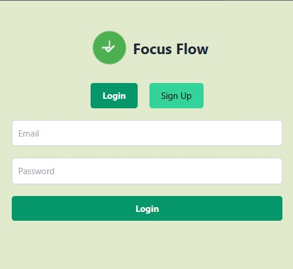
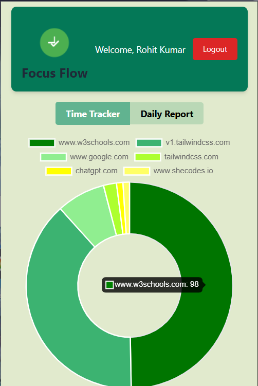

# Focus Flow - Track Productivity

*Company*: CODETECH IT SOLUTIONS

*Name*: Rohit Kumar

*Intern ID*: CT12WC98

*Domain*: Mern Stack Web Development

*Duration*: 12 weeks

*Mentor*: Neela Santosh

Imagine having the power to effortlessly track your online activity and optimize your productivity with just a few clicks! FocuFlow Chrome extension is designed to monitor the time you spend on websites and generate insightful daily reports. With features like detailed charts and reports, you can gain a clear understanding of how you allocate your online hours. Enjoy peace of mind knowing that your data is secure with our robust user authentication system, which includes seamless login, signup, and logout functionalities. Your personalized dashboard, accessible only after you log in, will provide a tailored experience, making it easier for you to analyze your habits and make informed decisions. Built on the reliable MERN stack (MongoDB, Express, React, Node.js) and employing JWT-based authentication, this project combines cutting-edge technology with user-centric design. Join us in enhancing your online efficiency and take control of your time today!

## Features

- Track time spent on websites daily.
- View detailed reports and charts of time spent.
- User authentication with login, signup, and logout.
- Dashboard visible only after login.
- Backend built with MERN stack (MongoDB, Express, React, Node.js).
- JWT-based authentication.

## Setup and Run

### Backend

1. Install dependencies:

```bash
npm install express mongoose cors dotenv bcrypt jsonwebtoken
```

2. Create a `.env` file with:

```
MONGO_URI=your_mongodb_connection_string
JWT_SECRET=your_jwt_secret_key
PORT=5000
```

3. Start the server:

```bash
node server.js
```

or with nodemon:

```bash
nodemon server.js
```

### Frontend

- Load the extension in Chrome via `chrome://extensions` > Load unpacked > select the project directory.

## Images

### image1.jpg



### image2.png




-----

Made by Rohit 🐱‍🏍
